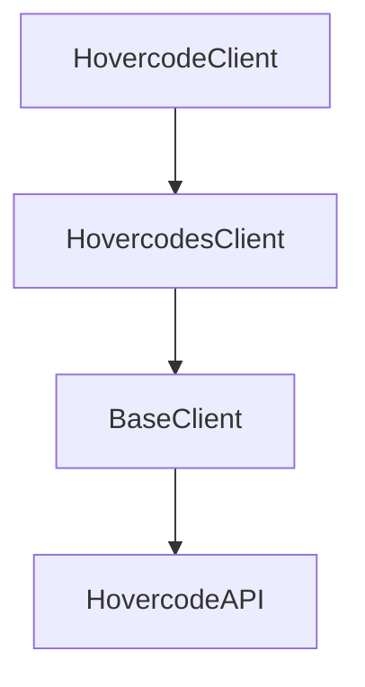

## API reference

This section is generated from the library’s docstrings using `mkdocstrings`.

### Key classes

- `hovercode.client.HovercodeClient`: the main facade client
- `hovercode.hovercodes.HovercodesClient`: QR code operations

### Architecture overview

The SDK is structured as a small facade client that exposes domain clients:



- `HovercodeClient` stores shared config (token/base URL/timeouts/retries).
- Domain clients (like `HovercodesClient`) implement the business methods (create/list/update…).
- `BaseClient` owns the HTTP session, auth header, retry/backoff, JSON decoding, and error mapping.

### Naming note

`HovercodesClient` also provides high-level methods like:

- `get_hovercode(qr_code_id)`
- `delete_hovercode(qr_code_id)`

These names intentionally avoid clashing with the lower-level HTTP helper
methods on the shared transport client.

### Transport configuration

You can configure timeouts/retries either via constructor args or environment variables:

- `HOVERCODE_TIMEOUT_SECONDS` (default: 10.0)
- `HOVERCODE_MAX_RETRIES` (default: 3)
- `HOVERCODE_RETRY_BACKOFF_SECONDS` (default: 0.5)

```python
from hovercode import HovercodeClient

client = HovercodeClient(
    timeout_seconds=20.0,
    max_retries=5,
    retry_backoff_seconds=0.5,
)
```

